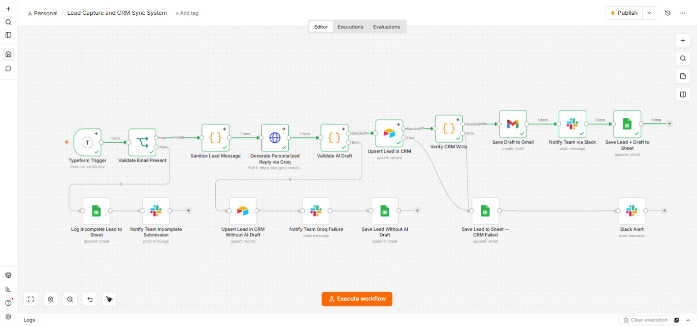

# Lead Capture and CRM Sync System

An end-to-end AI-powered lead automation workflow built in **n8n**. It captures leads from a Typeform submission, validates and sanitizes the data, generates a personalized AI reply, syncs everything to a CRM, and notifies the team — with verification and fallback handling at every failure-prone step.

## The Problem

Without automation, every lead requires manual work at every stage — checking if the email is valid, copying details into a CRM, writing a thoughtful reply, and notifying the right team member, all while avoiding typos and delays. Doing this by hand means errors are inevitable, and it either eats into the sales team's time directly or requires hiring someone specifically to manage it.

## What This Workflow Does

1. **Validation** — Every Typeform submission is checked for a valid email and name. Incomplete leads are never discarded — they're logged to a dedicated sheet and the team is alerted on Slack for manual follow-up.

2. **Message Sanitization** — Lead messages are checked for length and safely truncated before being sent to the AI, keeping token usage predictable and cost-efficient.

3. **AI Reply Generation with Verification** — The message is sent to Groq (Llama 3.3 70B) to generate a short, personalized reply. The workflow doesn't just trust a "success" response — it actively validates that the AI output isn't empty, didn't silently fail, and doesn't contain leftover placeholder text. If any check fails, the workflow doesn't break: the lead is still saved to the CRM with a clear fallback note, and the team is alerted immediately.

4. **Verified CRM Sync** — After writing the lead to Airtable, the workflow reads back what was actually saved and confirms the data wasn't dropped or truncated before proceeding. Only a verified write triggers the next step.

5. **Draft & Notification** — Once verified, a ready-to-send email draft is created in Gmail and the team is notified on Slack with full lead context.

6. **Backup Logging** — Every lead, regardless of which path it takes (complete, incomplete, AI failure, or CRM failure), is logged to Google Sheets as an append-only history — so no interaction is ever lost or overwritten.

## Why It's Built This Way

Most automations stop at "the node ran without an error." This one treats a completed step and a *correct* step as two different claims. Every external call (AI generation, CRM write) is followed by a validation step that checks the actual returned data — not just the HTTP status — before the workflow proceeds. If a step fails at any point, in any branch, the lead is preserved and the team is notified. Nothing depends on a single point of failure.

## Tools Used

`n8n` · `Typeform` · `Groq AI (Llama 3.3 70B)` · `Airtable` · `Gmail` · `Slack` · `Google Sheets` · `JavaScript` (custom validation logic)

## Files in This Repo

- `Lead_Capture_and_CRM_Sync_System.json` — Full exportable n8n workflow (import directly into your own n8n instance)
- `Lead_Capture_and_CRM_Sync_System_Workflow.png` — Visual workflow diagram
- `README.md` — This file

## Setup

1. Import the JSON file into your n8n instance (`Import from File`).
2. Connect your own credentials for Typeform, Groq, Airtable, Gmail, and Slack.
3. Update the Typeform form ID and Airtable base/table references to match your own setup.
4. Activate the workflow.

## About

Built by **Sami** — AI Workflow Automation Specialist, specializing in n8n-based automation for small businesses and startups.
